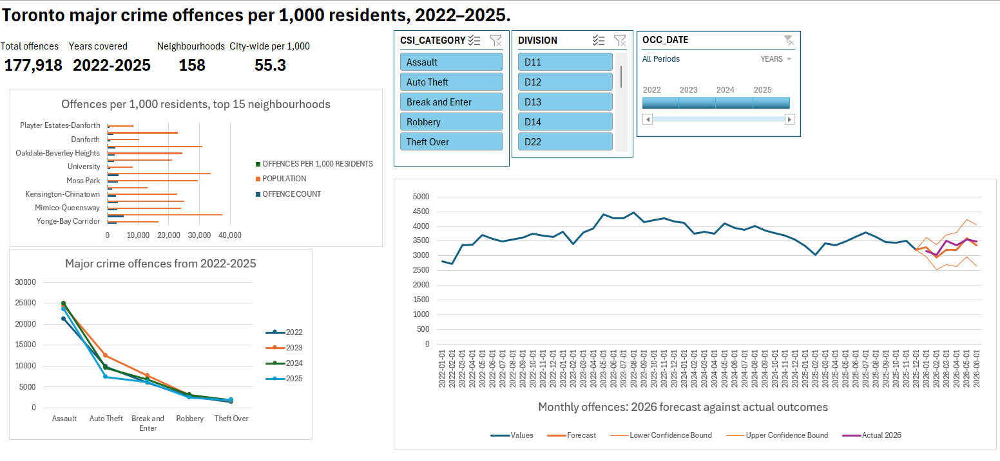
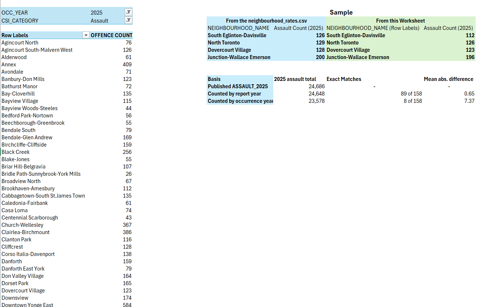
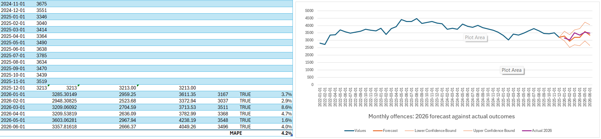

# Toronto Major Crime: A Validated Neighbourhood Analysis in Excel

**My own offence counts reconcile with Toronto Police's published neighbourhood figures to within 0.15% once the counting basis is aligned, and a forecast built on 2022-2025 held up against six months of real 2026 outcomes.**

Built in Excel with Power Query, a relational data model and DAX, from 486,204 offence records published by the Toronto Police Service, joined to 2025 neighbourhood population.

## 1. Validation against published figures

Toronto Police publish neighbourhood-level counts in the Neighbourhood Crime Rates file. I reconciled my own 2025 assault counts against ASSAULT_2025 across all 158 neighbourhoods. Counting by occurrence year, my total was 23,578 against a published 24,686, with only 8 of 158 neighbourhoods matching exactly. Recounting on a report-year basis gave 24,648 against 24,686 - a difference of 0.15% - with 89 of 158 matching exactly and a mean absolute difference of 0.65 offences per neighbourhood. The published figures are compiled by report year. This analysis uses occurrence year, because when an offence took place is the relevant dimension for a neighbourhood analysis. The difference between the two bases is documented rather than reconciled away.

| Basis | 2025 assault total | Exact matches (of 158) | Mean absolute difference |
|---|---|---|---|
| Published `ASSAULT_2025` | 24,686 | | |
| My count, report year | 24,648 | 89 | 0.65 |
| My count, occurrence year | 23,578 | 8 | 7.37 |

## 2. The forecast, tested against real outcomes

The forecast used only 2022-2025 data and predicted January to June 2026. Those six months already exist in the source extract, so this is an out-of-sample test rather than a claim about the future.

| Month 2026 | Forecast | Actual | Inside 95% interval |
|---|---|---|---|
| Jan | 3,285 | 3,167 | Yes |
| Feb | 2,948 | 3,037 | Yes |
| Mar | 3,209 | 3,511 | Yes |
| Apr | 3,210 | 3,368 | Yes |
| May | 3,603 | 3,548 | Yes |
| Jun | 3,358 | 3,496 | Yes |

All six actuals fell inside the 95% interval, with a mean absolute percentage error of 4.2%. The six-month forecast total was 19,613 against an actual 20,127, 2.6% low.

The result is consistent with a well-specified model, not proof of accuracy: six points is a small test. June 2026 is probably understated, since offences reported in July are not in the extract, and the forecast still under-predicted slightly overall.

Method: Excel `FORECAST.ETS` (exponential triple smoothing), monthly data, seasonality 12, 95% confidence interval.

## 3. Auto theft fell 41% from its 2023 peak

| Category | 2022 | 2023 | 2024 | 2025 | 2023 to 2025 |
|---|---|---|---|---|---|
| Auto Theft | 9,847 | 12,427 | 9,578 | 7,313 | -41.2% |
| All five categories | 41,258 | 49,112 | 46,196 | 41,352 | -15.8% |
| Theft Over | 1,423 | 1,727 | 1,856 | 1,862 | +7.8% |

The auto theft decline also holds on a report-year basis (12,447 to 7,337, -41%), so it is not an artefact of the counting choice in section 1. Theft Over is the only category that rose every year.

## 4. Per-capita ranking, and its limits

Across 2022-2025 there were 55.34 offences per 1,000 residents city-wide. That is a four-year cumulative figure; the annual average is about 13.8 per 1,000.

- 7 of the top 10 neighbourhoods are the same by raw count and per capita. Annex, Wellington Place and Etobicoke City Centre leave the top 10; Humber Summit, University and Yorkdale-Glen Park enter.
- The movement is in the middle. Largest risers: Playter Estates-Danforth (113th by count to 15th per capita) and Beechborough-Greenbrook (139th to 38th). Largest fallers: Agincourt North (64th to 145th) and Tam O'Shanter-Sullivan (54th to 139th).

Raw offence counts largely track population (rank correlation 0.77). Dividing by residents corrects for that, but it overstates small neighbourhoods and places where far more people visit or work than live. Neither ranking alone is the answer.

The largest risers all have 8,000 to 10,400 residents, where a small denominator magnifies a handful of offences. The per-capita top 10 includes the financial core, the University of Toronto and York University campuses and Yorkdale; that residential population is the wrong denominator for these places is my judgement from the neighbourhood names, not something the data proves.

## How it was built

- **Power Query:** imported the offence extract, kept 16 of 30 columns, removed 7,459 rows with no assigned neighbourhood, filtered to occurrence years 2022-2025 (177,918 rows), and set types. M code in [`queries/`](queries/).
- **Data model:** a many-to-one relationship on the numeric neighbourhood ID `HOOD_158`, joining offences to 158 neighbourhoods. The ID is zero-padded in one source and not the other, so it is typed as a whole number on both sides.
- **DAX:** four measures, including a share-of-total using `CALCULATE` and `ALL`. See [`docs/dax_measures.md`](docs/dax_measures.md). The model table is named `Incidents`; every row in it is an offence.
- **Dashboard:** PivotCharts with slicers on crime category and police division and a timeline on occurrence date.

## Files

| Path | Contents |
|---|---|
| `workbook/toronto_crime_analysis.xlsx` | The workbook. Re-point the queries before refreshing: see `docs/DATA_SOURCE.md` |
| `docs/toronto_crime_analysis.pdf` | Dashboard, forecast and reconciliation, readable without Excel |
| `docs/limitations.md` | Every known limitation, in one place |
| `docs/DATA_SOURCE.md` | Where the data comes from and how to reproduce it |
| `queries/`, `docs/dax_measures.md` | The Power Query and DAX code |

Data: Toronto Police Service Public Safety Data Portal, extract to 30 June 2026. Full limitations in [`docs/limitations.md`](docs/limitations.md).
